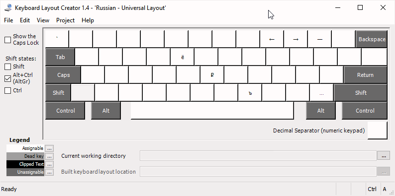
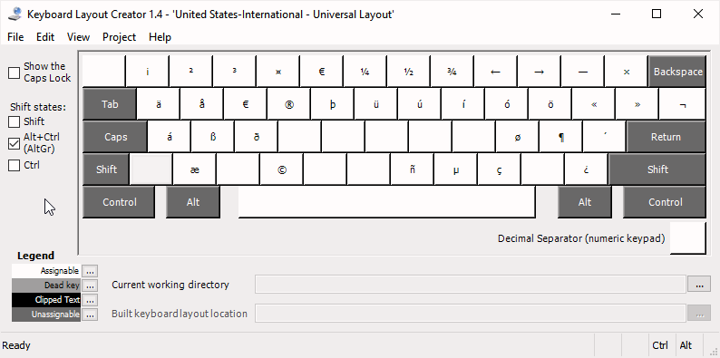
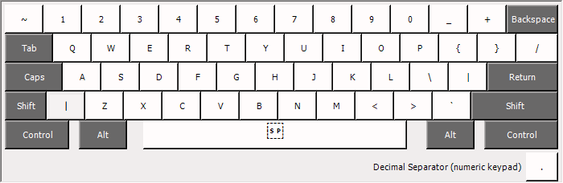
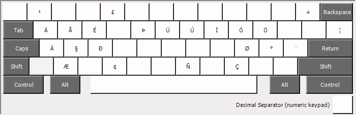

# Windows Universal Layout
Package of Russian and English keyboard layouts, designed for convenient simultaneous usage.

Installation packages for keyboard layouts can be created by [Microsoft Keyboard Layout Creator](https://www.microsoft.com/en-us/download/details.aspx?id=22339).

Heavily inspired by Nikita Prokopov's [Universal Layout](https://github.com/tonsky/Universal-Layout).

## Screenshots

### Russian layout

Shift pressed:

Right Alt pressed:

Shift & Right Alt pressed:

### English layout

 

Shift pressed:

Right Alt pressed:

Shift & Right Alt pressed:

